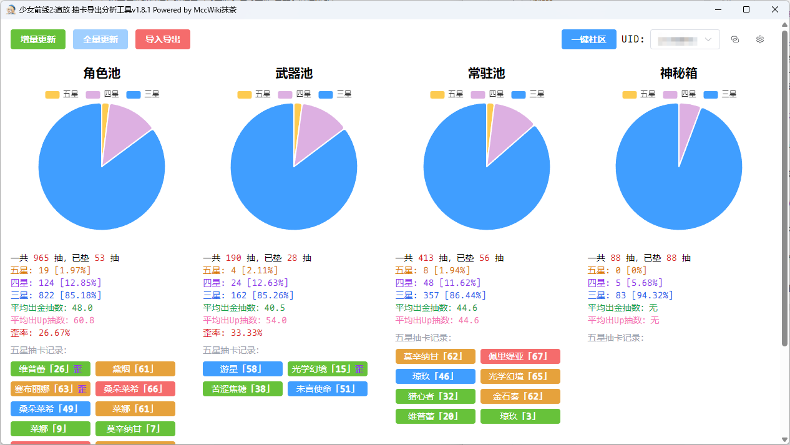

# 少女前线2:追放 抽卡导出分析工具

## 为什么做这个工具？

[追放采购记录导出工具](https://github.com/EtherealAO/exilium-recruit-export)作者在其[NGA发布贴](https://bbs.nga.cn/read.php?tid=38812531)中表示不搞了，希望有人接盘

但我并不熟悉`Electron`，也不太喜欢`Electron`直接包一个巨大浏览器的做法

于是把之前自用的导出程序用更加轻量的`Wails`包了个界面传了上来

## 主要功能

- [x] 增量更新 `拉取服务端最新的抽卡数据，与本地数据合并`
- [x] 全量更新 `拉取服务端所有抽卡数据，与本地数据合并(目前合并算法准备重写，完成后再做)`
- [x] 一键社区 `一键完成社区签到与任务，并根据自定义设置兑换道具`
- [x] 导入Ere数据 `导入EreJson或EreExcel格式的数据，与本地数据合并(合并前会自动备份数据库)`
- [x] 导入/导出RawJson `导入/导出服务器原始格式的数据的map`
- [x] 导入/导出MccExcel `导入/导出Mcc格式的Excel`

## 基本原理

本软件通过读取日志获取`游戏路径`、`抽卡链接`、`UID`、`AccessToken`，进而从服务器获取抽卡记录

本软件会在当前目录下的生成名为`gf2gacha.db`的`sqlite`数据库，这就是你的抽卡数据了，你可以使用任何支持sqlite的数据库管理工具查看其内容

## 特别提醒

本软件不会将用户数据传输到任何第三方服务上，数据仅存储在你本地

进行高危操作时(如合并数据)，数据库会自动备份

如果你有云端托管数据的需求，请点击软件右上角的`回形针图标`查看你当前日志信息，将其复制给第三方服务提供方

注意！`AccessToken`是你的临时登录凭证，请勿随意泄露

## FAQ

### 为什么看不到新手池数据？为什么角色池/武器池/常驻池缺失数据？

追放服务器只保留最近180天的数据，大多数抽卡游戏都有类似的限制，所以有需求的用户才会采取多种办法来保存抽卡记录

### 如何导入来自[追放采购记录导出工具](https://github.com/EtherealAO/exilium-recruit-export)的数据?

由于ERE的UID使用的UID并不是游戏内的UID，我无法判断原数据是属于哪个用户

**请务必先在主界面手动选择你要导入旧数据的用户对应的UID**

然后点击`导入ERE数据`按钮，在ERE程序目录中找到`userData`文件夹，选择里面类似`gacha-list-1234567890.json`的文件,点击确定即可

## 附录

### 卡池类型

| PoolType | 备注    |
|----------|-------|
| 1        | 常驻池   |
| 2        | 暂无    |
| 3        | 角色池   |
| 4        | 武器池   |
| 5        | 新手池   |
| 6        | 自选角色池 |
| 7        | 自选武器池 |
| 8        | 神秘箱   |

### 卡池信息

| PoolId | 备注           | 时间戳起       | 时间戳止       | 时间起                           | 时间止                           |
|--------|--------------|------------|------------|-------------------------------|-------------------------------|
| 1001   | 常规采购         |            |            |                               |                               |
| 2001   | 军备提升β-托洛洛武器  | 1703124000 | 1704358799 | 2023-12-21 10:00:00 +0800 CST | 2024-01-04 16:59:59 +0800 CST |
| 3001   | 定向采购β-托洛洛    | 1703124000 | 1704358799 | 2023-12-21 10:00:00 +0800 CST | 2024-01-04 16:59:59 +0800 CST |
| 4001   | 初始采购-新手池     |            |            |                               |                               |
| 5001   | 军备提升α-黛烟武器   | 1703494800 | 1705913999 | 2023-12-25 17:00:00 +0800 CST | 2024-01-22 16:59:59 +0800 CST |
| 6001   | 定向采购α-黛烟     | 1703494800 | 1705913999 | 2023-12-25 17:00:00 +0800 CST | 2024-01-22 16:59:59 +0800 CST |
| 7001   | 定向采购β-塞布丽娜   | 1705395600 | 1706605199 | 2024-01-16 17:00:00 +0800 CST | 2024-01-30 16:59:59 +0800 CST |
| 8001   | 军备提升β-塞布丽娜武器 | 1705395600 | 1706605199 | 2024-01-16 17:00:00 +0800 CST | 2024-01-30 16:59:59 +0800 CST |
| 9001   | 定向采购α-桑朵莱希   | 1705978800 | 1708657199 | 2024-01-23 11:00:00 +0800 CST | 2024-02-23 10:59:59 +0800 CST |
| 10001  | 军备提升α-桑朵莱希武器 | 1705978800 | 1708657199 | 2024-01-23 11:00:00 +0800 CST | 2024-02-23 10:59:59 +0800 CST |
| 11001  | 定向采购β-琼玖     | 1707382800 | 1708657199 | 2024-02-08 17:00:00 +0800 CST | 2024-02-23 10:59:59 +0800 CST |
| 12001  | 军备提升β-琼玖武器   | 1707382800 | 1708657199 | 2024-02-08 17:00:00 +0800 CST | 2024-02-23 10:59:59 +0800 CST |
| 13001  | 定向采购α-莱娜     | 1708657200 | 1711421999 | 2024-02-23 11:00:00 +0800 CST | 2024-03-26 10:59:59 +0800 CST |
| 14001  | 军备提升α-莱娜武器   | 1708657200 | 1711421999 | 2024-02-23 11:00:00 +0800 CST | 2024-03-26 10:59:59 +0800 CST |
| 15001  | 定向采购-黛烟      | 1712653200 | 1714445999 | 2024-04-09 17:00:00 +0800 CST | 2024-04-30 10:59:59 +0800 CST |
| 16001  | 军备提升-黛烟武器    | 1712653200 | 1714445999 | 2024-04-09 17:00:00 +0800 CST | 2024-04-30 10:59:59 +0800 CST |
| 17001  | 定向采购-绛雨      | 1711422000 | 1714445999 | 2024-03-26 11:00:00 +0800 CST | 2024-04-30 10:59:59 +0800 CST |
| 18001  | 军备提升-绛雨武器    | 1711422000 | 1714445999 | 2024-03-26 11:00:00 +0800 CST | 2024-04-30 10:59:59 +0800 CST |
| 19001  | 定向采购β-莫辛纳甘   | 1709629200 | 1711421999 | 2024-03-05 17:00:00 +0800 CST | 2024-03-26 10:59:59 +0800 CST |
| 20001  | 军备提升β-莫辛纳甘武器 | 1709629200 | 1711421999 | 2024-03-05 17:00:00 +0800 CST | 2024-03-26 10:59:59 +0800 CST |
| 21001  | 定向采购-佩里缇亚    | 1711422000 | 1712653199 | 2024-03-26 11:00:00 +0800 CST | 2024-04-09 16:59:59 +0800 CST |
| 22001  | 军备提升-佩里缇亚武器  | 1711422000 | 1712653199 | 2024-03-26 11:00:00 +0800 CST | 2024-04-09 16:59:59 +0800 CST |
| 23001  | 定向采购-玛绮朵     | 1714446000 | 1717556399 | 2024-04-30 11:00:00 +0800 CST | 2024-06-05 10:59:59 +0800 CST |
| 24001  | 军备提升-玛绮朵武器   | 1714446000 | 1717556399 | 2024-04-30 11:00:00 +0800 CST | 2024-06-05 10:59:59 +0800 CST |
| 25001  | 定向采购-桑朵莱希    | 1715677200 | 1717556399 | 2024-05-14 17:00:00 +0800 CST | 2024-06-05 10:59:59 +0800 CST |
| 26001  | 军备提升-桑朵莱希武器  | 1715677200 | 1717556399 | 2024-05-14 17:00:00 +0800 CST | 2024-06-05 10:59:59 +0800 CST |
| 27001  | 定向采购-乌尔丽德    | 1717556400 | 1719284399 | 2024-06-05 11:00:00 +0800 CST | 2024-06-25 10:59:59 +0800 CST |
| 28001  | 军备提升-乌尔丽德武器  | 1717556400 | 1719284399 | 2024-06-05 11:00:00 +0800 CST | 2024-06-25 10:59:59 +0800 CST |
| 29001  | 定向采购-莱娜      | 1717556400 | 1719284399 | 2024-06-05 11:00:00 +0800 CST | 2024-06-25 10:59:59 +0800 CST |
| 30001  | 军备提升-莱娜武器    | 1717556400 | 1719284399 | 2024-06-05 11:00:00 +0800 CST | 2024-06-25 10:59:59 +0800 CST |
| 31001  | 定向采购-索米      | 1719284400 | 1721098799 | 2024-06-25 11:00:00 +0800 CST | 2024-07-16 10:59:59 +0800 CST |
| 32001  | 军备提升-索米武器    | 1719284400 | 1721098799 | 2024-06-25 11:00:00 +0800 CST | 2024-07-16 10:59:59 +0800 CST |
| 33001  | 定向采购-绛雨      | 1719284400 | 1721098799 | 2024-06-25 11:00:00 +0800 CST | 2024-07-16 10:59:59 +0800 CST |
| 34001  | 军备提升-绛雨武器    | 1719284400 | 1721098799 | 2024-06-25 11:00:00 +0800 CST | 2024-07-16 10:59:59 +0800 CST |
| 35001  | 定向采购-杜莎妮     | 1721098800 | 1722913199 | 2024-07-16 11:00:00 +0800 CST | 2024-08-06 10:59:59 +0800 CST |
| 36001  | 军备提升-杜莎妮武器   | 1721098800 | 1722913199 | 2024-07-16 11:00:00 +0800 CST | 2024-08-06 10:59:59 +0800 CST |
| 37001  | 定向采购-玛绮朵     | 1721098800 | 1722913199 | 2024-07-16 11:00:00 +0800 CST | 2024-08-06 10:59:59 +0800 CST |
| 38001  | 军备提升-玛绮朵武器   | 1721098800 | 1722913199 | 2024-07-16 11:00:00 +0800 CST | 2024-08-06 10:59:59 +0800 CST |
| 39001  | 定向采购-朝晖      | 1722913200 | 1724705999 | 2024-08-06 11:00:00 +0800 CST | 2024-08-27 04:59:59 +0800 CST |
| 40001  | 军备提升-朝晖武器    | 1722913200 | 1724705999 | 2024-08-06 11:00:00 +0800 CST | 2024-08-27 04:59:59 +0800 CST |
| 41001  | 定向采购-乌尔丽德    | 1722913200 | 1724705999 | 2024-08-06 11:00:00 +0800 CST | 2024-08-27 04:59:59 +0800 CST |
| 42001  | 军备提升-乌尔丽德武器  | 1722913200 | 1724705999 | 2024-08-06 11:00:00 +0800 CST | 2024-08-27 04:59:59 +0800 CST |
| 43001  | 定向采购-可露凯     | 1724706000 | 1726714799 | 2024-08-27 05:00:00 +0800 CST | 2024-09-19 10:59:59 +0800 CST |
| 44001  | 军备提升-可露凯武器   | 1724706000 | 1726714799 | 2024-08-27 05:00:00 +0800 CST | 2024-09-19 10:59:59 +0800 CST |
| 45001  | 定向采购-索米      | 1724706000 | 1726714799 | 2024-08-27 05:00:00 +0800 CST | 2024-09-19 10:59:59 +0800 CST |
| 46001  | 军备提升-索米武器    | 1724706000 | 1726714799 | 2024-08-27 05:00:00 +0800 CST | 2024-09-19 10:59:59 +0800 CST |
| 90001  | 自选采购·人形      | 1724706000 | 1728442799 | 2024-08-27 05:00:00 +0800 CST | 2024-10-09 10:59:59 +0800 CST |
| 91001  | 自选采购·军备      | 1724706000 | 1728442799 | 2024-08-27 05:00:00 +0800 CST | 2024-10-09 10:59:59 +0800 CST |
| 99001  | 神秘箱          | 1689476400 | 4089668399 | 2023-07-16 11:00:00 +0800 CST | 2099-08-06 10:59:59 +0800 CST |

### 人形信息

| ItemId                          | Rank                         | 备注                              |
|---------------------------------|------------------------------|---------------------------------|
| 1001 | 4 | 克罗丽科 |
| 1008 | 4 | 纳美西丝 |
| 1009 | 4 | 寇尔芙  |
| 1013 | 5 | 莱娜   |
| 1015 | 5 | 维普蕾  |
| 1017 | 4 | 闪电   |
| 1021 | 5 | 佩里缇亚 |
| 1022 | 4 | 夏克里  |
| 1023 | 5 | 杜莎妮  |
| 1024 | 4 | 奇塔   |
| 1025 | 5 | 托洛洛  |
| 1026 | 4 | 纳甘   |
| 1027 | 5 | 琼玖   |
| 1028 | 5 | 桑朵莱希 |
| 1029 | 5 | 塞布丽娜 |
| 1032 | 5 | 黛烟   |
| 1033 | 5 | 莫辛纳甘 |
| 1034 | 5 | 玛绮朵  |
| 1035 | 5 | 绛雨   |
| 1036 | 4 | 科谢尼娅 |
| 1037 | 5 | 乌尔丽德 |
| 1038 | 4 | 莉塔拉  |
| 1039 | 5 | 索米   |
| 1040 | 5 | 波波沙  |
| 1041 | 4 | 洛塔   |
| 1050 | 5 | 朝晖   |
| 1052 | 5 | 可露凯  |

### 武器信息

| ItemId                           | Rank                         | 备注                                      |
|----------------------------------|------------------------------|-----------------------------------------|
| 10001 | 5 | 喧闹恶灵         |
| 10002 | 5 | 绝密手稿         |
| 10003 | 5 | 阿尔克纳         |
| 10004 | 5 | 盖尔诺          |
| 10005 | 5 | 王冠鹿角兔        |
| 10006 | 5 | 妙尔尼尔         |
| 10007 | 5 | 远行游鸽         |
| 10131 | 3 | 旧式通用冲锋枪9     |
| 10132 | 4 | 通用冲锋枪9       |
| 10133 | 5 | 幼狮           |
| 10231 | 3 | 旧式科夫罗夫       |
| 10232 | 4 | 科夫罗夫         |
| 10233 | 5 | 传颂之诗         |
| 10331 | 3 | 旧式莫辛-纳甘      |
| 10332 | 4 | 莫辛-纳甘        |
| 10333 | 5 | 斯摩希克         |
| 10341 | 3 | 旧式瓦尔特2000    |
| 10342 | 4 | 瓦尔特2000      |
| 10343 | 5 | 苦涩焦糖         |
| 10351 | 3 | 旧式九七式        |
| 10352 | 4 | 九七式          |
| 10353 | 5 | 跃虎           |
| 10361 | 3 | 旧式斯捷奇金       |
| 10362 | 4 | 斯捷奇金         |
| 10371 | 3 | 旧式羽锋         |
| 10372 | 4 | 羽锋           |
| 10373 | 5 | 流羽白英         |
| 10381 | 3 | 旧式加利尔轻机枪     |
| 10382 | 4 | 加利尔轻机枪       |
| 10391 | 3 | 旧式索米         |
| 10392 | 4 | 索米           |
| 10393 | 5 | 未言使命         |
| 10401 | 3 | 旧式波波沙冲锋枪     |
| 10402 | 4 | 波波沙冲锋枪       |
| 10403 | 5 | 斯瓦罗格         |
| 10411 | 3 | 旧式超级90       |
| 10412 | 4 | 超级90         |
| 10501 | 3 | 旧式长风零六       |
| 10502 | 4 | 长风零六         |
| 10503 | 5 | 不留行          |
| 10521 | 3 | 旧式黑克勒科赫416   |
| 10522 | 4 | 黑克勒科赫416     |
| 10523 | 5 | 斯库拉          |
| 11007 | 4 | 野兔           |
| 11008 | 3 | 旧式金牛座曲线      |
| 11009 | 3 | 旧式复仇女神       |
| 11010 | 3 | 旧式格洛利娅       |
| 11014 | 4 | 复仇女神         |
| 11015 | 4 | 金牛座曲线        |
| 11016 | 5 | 猎心者          |
| 11017 | 3 | 旧式莫洛12       |
| 11020 | 5 | 光学幻境         |
| 11021 | 4 | 莫洛12         |
| 11022 | 3 | 旧式野兔         |
| 11023 | 4 | 格洛利娅         |
| 11024 | 3 | 旧式佩切涅        |
| 11026 | 4 | 佩切涅          |
| 11030 | 3 | 旧式罗宾逊先进步枪    |
| 11031 | 4 | 罗宾逊先进步枪      |
| 11036 | 3 | 旧式卡拉什-阿尔法    |
| 11037 | 4 | 卡拉什-阿尔法      |
| 11038 | 5 | 游星           |
| 11039 | 3 | 旧式黑科赫7       |
| 11040 | 4 | 黑科赫7         |
| 11042 | 3 | 旧式一九一式       |
| 11043 | 4 | 一九一式         |
| 11044 | 5 | 金石奏          |
| 11045 | 3 | 旧式特殊用途自动型霰弹枪 |
| 11046 | 4 | 特殊用途自动型霰弹枪   |
| 11047 | 5 | 梅扎露娜         |
| 11048 | 3 | 旧式纳甘左轮       |
| 11049 | 4 | 纳甘左轮         |
| 11051 | 3 | 旧式九五式        |
| 11052 | 4 | 九五式          |
| 11053 | 5 | 重弦           |
| 11054 | 3 | 旧式格威尔36      |
| 11055 | 4 | 格威尔36        |
| 11056 | 5 | 女仆准则         |